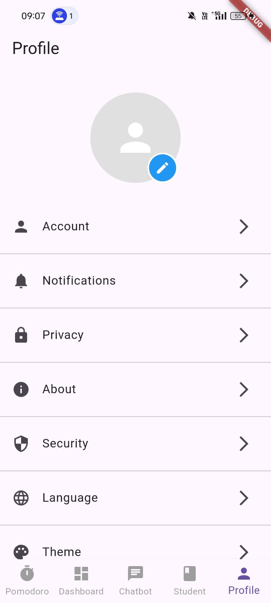

Below is a sample README.md for Synapse:

---

# Synapse

Synapse is an AI-powered Flutter application designed to help students manage stress during crucial examination periods. It combines gamification, insightful usage statistics, and emotional tracking to ensure students stay motivated and aware of their habits while preparing for exams.

## Table of Contents

- [Introduction](#introduction)
- [Features](#features)
- [Setup & Installation](#setup--installation)
- [Usage](#usage)
- [Screenshots](#screenshots)
- [Architecture](#architecture)
- [Contributing](#contributing)
- [License](#license)

## Introduction

In today’s fast-paced academic environment, students often struggle with managing their study time, phone usage, and overall emotional well-being. Synapse addresses these challenges by offering:

- **Gamification & Shop:** Earn points through focused study sessions (using Pomodoro techniques) and maintain streaks to unlock rewards in our in-app shop.
- **Usage Statistics Dashboard:** Get clear insights on how much you work and track phone usage to better understand your habits.
- **Emotional Sentiment Analysis:** Leverage data from Fitbit to monitor your emotional state using a Random Forest classifier, providing personalized feedback.
- **Integrated Chatbot:** Get real-time support and guidance during your study sessions.

Synapse is more than just a study aid—it’s your personal assistant in managing stress and boosting productivity.

## Features

- **Pomodoro Timer & Streaks:**  
  Keep yourself accountable by using the Pomodoro technique. The longer your streak of focused work sessions, the more points you earn!

- **Gamification & Shop:**  
  Enjoy short-term gratification with rewards available in our in-app shop. Redeem your points for exciting items, motivating you to keep pushing forward.

- **Usage Statistics Dashboard:**  
  Visualize your work patterns and phone usage to gain insight into your habits. Track progress over days and weeks with detailed statistics.

- **Emotional Sentiment Analysis:**  
  Integrates with Fitbit to analyze your emotional state. Our Random Forest classifier interprets the data to help you understand and manage your feelings effectively.

- **Chatbot:**  
  Get instant support and answers to your questions through our AI-powered chatbot, available 24/7.

- **Customizable Settings:**  
  Tailor your experience with various settings that adapt to your personal study and relaxation preferences.

## Setup & Installation

### Prerequisites

- **Flutter SDK:**  
  Make sure you have Flutter installed on your machine. Follow the [official Flutter installation guide](https://flutter.dev/docs/get-started/install) for your operating system.

- **Dart:**  
  Ensure that you have Dart installed (comes with Flutter).

- **IDE:**  
  Use your preferred IDE for Flutter development (e.g., Android Studio, VS Code).

### Installation Steps

1. **Clone the Repository:**

   ```bash
   git clone https://github.com/techan-af/wellbeing.git
   cd synapse
   ```

2. **Install Dependencies:**

   Run the following command to install all required dependencies:

   ```bash
   flutter pub get
   ```

3. **Connect a Device or Start an Emulator:**

   Ensure you have a device connected or an emulator running.

4. **Run the App:**

   Start the application with:

   ```bash
   flutter run
   ```

5. **Backend Setup (if applicable):**

   If you are using a backend for features like the chatbot, ensure that the backend server is up and running, and update the URL in your code accordingly.

## Usage

Once installed, explore Synapse by navigating through its core sections:

- **Dashboard:**  
  View a summary of your study sessions, phone usage, and progress.
  
- **Chatbot:**  
  Interact with the AI-powered chatbot for study tips, stress management techniques, or just a quick motivational boost.

- **Statistics:**  
  Dive deep into your study patterns and see detailed charts representing your work and phone usage.

- **Shop:**  
  Use your hard-earned points to purchase rewards and enjoy short-term gratification to keep you motivated.

- **Settings:**  
  Customize the app to fit your study habits and personal preferences.

## Screenshots

*(Place your screenshots here to showcase the Chatbot, Dashboard, Usage Statistics, Settings, and Shop interfaces.)*

- **Home Screen:**  
  

- **Chatbot:**  
  

- **Usage Statistics:**  
  

- **Shop:**  
  

- **Settings:**  
  

  [LINK to Demo Video](https://drive.google.com/file/d/1qlB9aJyrt9Lyr-d7E0Dpz0Qx9nSfA9M0/view?usp=drive_link)

## Architecture

Synapse leverages Flutter’s reactive framework and integrates with several key technologies:

- **UI:**  
  Built with Flutter to deliver a responsive and beautiful interface across different devices.
  
- **Backend Integration:**  
  Utilizes HTTP requests to communicate with backend services for functionalities such as chatbot interactions.

- **Data Analysis:**  
  Processes Fitbit data to perform sentiment analysis using a Random Forest classifier, providing insights into emotional states.

- **State Management:**  
  Implements efficient state management to ensure smooth user experiences during data updates and UI rendering.

## Contributing

We welcome contributions from the community! If you’d like to help improve Synapse, please follow these steps:

1. Fork the repository.
2. Create a new branch for your feature or bugfix.
3. Commit your changes and push the branch.
4. Open a pull request describing your changes.

Please ensure your code adheres to the project’s coding standards and includes appropriate tests.


---

Synapse is dedicated to providing a stress-free study environment through innovative technology. Enjoy a balanced approach to productivity and well-being with every session!